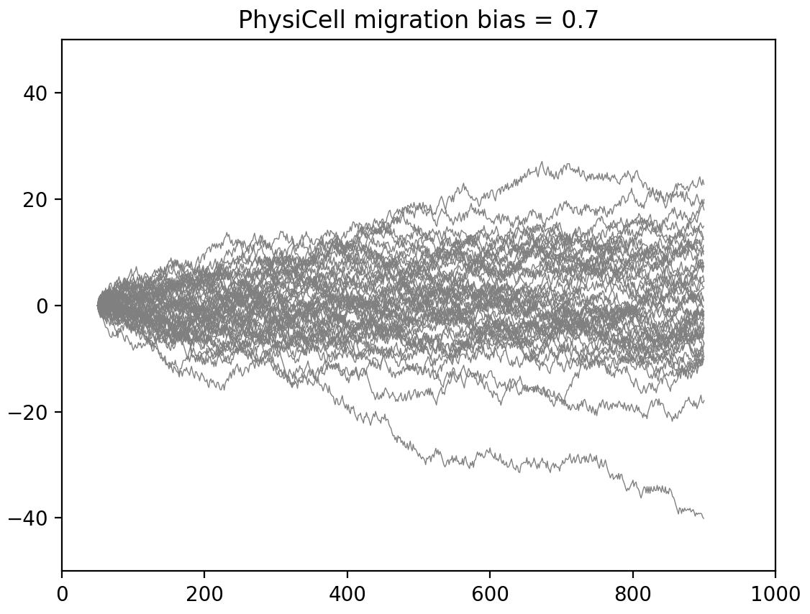

# PersistentCell reproducibility testing for PhysiCell

**Versions:** PhysiCell 1.14.0-RC

## Overview: 
Create a simple PhysiCell model to compare against https://github.com/tjsego/PersistentCell.

[Accompanying google doc](https://docs.google.com/document/d/1rxG1U6g_l0XT-2-CtrJEFT8HypmM9ygQYfiNKjdYAZI/edit) to easily capture early results.

This model has the following relevant edits to C++:
* `main.cpp`:
  - stop execution when the cell's x-pos > `max_x` (in User Params)
  - comment out call to `microenvironment.simulate_diffusion_decay` to speed up sim
* `custom_modules/custom.cpp : create_cell_types()`:
```
    SeedRandom();    // uses  std::chrono::system_clock::now().time_since_epoch().count();

    // cell_defaults.functions.update_migration_bias = custom_cell_motility;  //rwh
    std::vector<double> ctype1_direction {1.0, 0.0, 0.0};
    cell_defaults.phenotype.motility.migration_bias_direction = ctype1_direction;
```

## Run in the Studio
While not necessary to use PhysiCell Studio to run this model, it does make things easier. See [Studio dependencies](https://github.com/PhysiCell-Tools/Studio-Guide/blob/main/README.md#dependencies) and the rest of its Guide for more information.

We provide a slightly customized version of the Studio in this repo. Customizations include:
* drawing cell tracks
* `Clear` button (next to `Play`) on Plot tab, to remove tracks

```
python studio/bin/studio.py -c p_motion.xml
```
You can use `File -> Save user project` (or `Load user project`) to save/load different sets of params.

## Run N sims at command line
```
$ project p_motion_brief.xml 50
$ python plot_pos.py
```

 


